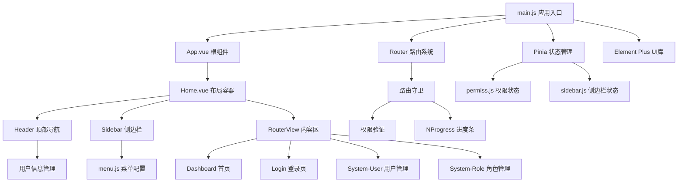

# Vue3 后台管理系统 - 深度架构分析报告

## 1. 项目概览

### 核心功能与技术栈
- **项目类型**: SPA (单页应用) 后台管理系统
- **技术栈**: Vue 3.4.29 + Vite 5.3.1 + Element Plus 2.7.7
- **状态管理**: Pinia 2.1.7
- **路由管理**: Vue Router 4.4.0 (History模式)
- **构建工具**: Vite (现代化构建工具)
- **UI组件库**: Element Plus (按需引入)

### 代码组织规范
```
src/
├── assets/          # 静态资源 (图片、样式)
├── components/      # 公共组件 (header, sidebar, menu)
├── router/          # 路由配置
├── store/           # Pinia状态管理
├── views/           # 页面组件
├── main.js          # 应用入口
└── App.vue          # 根组件
```

## 2. 架构解析

### 模块依赖关系图


### 初始化流程分析 (3层调用深度)

**第1层: main.js 应用启动**
```javascript
createApp(App) → 注册Element Plus组件 → 注册Pinia → 注册Router → 挂载到#app
```

**第2层: App.vue 根组件渲染**
```javascript
App.vue → useSidebarStore() → <router-view> 渲染
```

**第3层: 路由系统激活**
```javascript
Router → beforeEach守卫 → 权限验证 → NProgress.start() → 组件懒加载
```

## 3. 关键路径分析

### 路径1: 用户登录流程
**涉及文件**: `login.vue` → `permiss.js` → `router/index.js`
- **数据流**: 表单验证 → localStorage存储 → Pinia状态更新 → 路由跳转
- **异步处理**: ElMessage反馈、表单验证、路由守卫

### 路径2: 权限验证流程  
**涉及文件**: `router/index.js` → `permiss.js` → `sidebar.vue`
- **数据流**: 路由守卫 → 权限Store → 自定义指令v-permiss → 组件显隐
- **异步处理**: 路由拦截、权限匹配、403/404重定向

### 路径3: 侧边栏交互流程
**涉及文件**: `header.vue` → `sidebar.js` → `Home.vue`
- **数据流**: 点击事件 → Pinia状态变更 → CSS类切换 → 布局响应
- **异步处理**: 响应式布局、动画过渡

## 4. 代码质量审查

### 发现的问题 (5项)

1. **状态管理Bug**: `sidebar.js`中存在属性名不一致
   ```javascript
   // 问题: state中定义isCollapse，action中使用collapse
   state: { isCollapse: false }
   actions: { this.collapse = !this.collapse } // 应为this.isCollapse
   ```

2. **权限验证逻辑缺陷**: 硬编码的权限列表缺乏灵活性
   ```javascript
   // 问题: 权限配置写死在代码中，难以动态管理
   const defaultList = { admin: ['0','1','11'...], user: ['0','1','11'] }
   ```

3. **组件耦合度过高**: Header组件直接操作localStorage和路由
   ```javascript
   // 问题: 业务逻辑与UI组件耦合
   const handleCommand = () => {
       localStorage.removeItem('ms_name'); // 应抽象到store
       router.push('/login')
   }
   ```

4. **错误处理不完善**: 缺少全局错误边界和异常捕获
   ```javascript
   // 问题: 路由守卫中缺少异常处理
   router.beforeEach((to,from,next) => {
       // 缺少try-catch包装
   })
   ```

5. **性能优化不足**: Element Plus组件全量引入
   ```javascript
   // 问题: 按需引入但仍手动注册大量组件
   app.use(ElButton).use(ElForm)... // 应使用自动导入插件
   ```

## 5. 依赖分析

### 关键第三方依赖
- **vue (^3.4.29)**: 核心框架 ✅ 最新稳定版
- **element-plus (^2.7.7)**: UI组件库 ✅ 最新版本  
- **vue-router (^4.4.0)**: 路由管理 ✅ 最新版本
- **pinia (^2.1.7)**: 状态管理 ✅ 最新版本
- **nprogress (^0.2.0)**: 进度条 ⚠️ 版本较旧 (最新0.2.2)
- **vite (^5.3.1)**: 构建工具 ✅ 较新版本

### 依赖风险评估
- 整体依赖版本较新，安全性良好
- nprogress可考虑升级或替换为更现代的方案

## 6. 优化建议

### 高价值改进方向

1. **状态管理重构**
   ```javascript
   // 建议: 统一用户状态管理，避免localStorage直接操作
   export const useUserStore = defineStore('user', {
     state: () => ({ token: '', userInfo: {}, permissions: [] }),
     actions: { 
       login(credentials) { /* 统一登录逻辑 */ },
       logout() { /* 统一登出逻辑 */ }
     }
   })
   ```

2. **组件自动导入优化**
   ```javascript
   // 建议: 使用unplugin-auto-import减少手动注册
   // vite.config.js
   import AutoImport from 'unplugin-auto-import/vite'
   import Components from 'unplugin-vue-components/vite'
   import { ElementPlusResolver } from 'unplugin-vue-components/resolvers'
   ```

3. **权限系统动态化**
   ```javascript
   // 建议: 权限配置从API获取，支持动态权限管理
   const permissStore = defineStore('permiss', {
     actions: {
       async fetchPermissions() {
         const res = await api.getUserPermissions()
         this.permissions = res.data
       }
     }
   })
   ```

### 架构优化建议
- 引入TypeScript提升代码质量
- 添加单元测试覆盖核心业务逻辑  
- 实现组件懒加载和代码分割
- 建立统一的API请求层和错误处理机制

这个项目整体架构清晰，使用了现代化的Vue3生态，但在状态管理、权限系统和组件解耦方面还有优化空间。建议优先修复sidebar状态管理bug，然后逐步重构权限系统和用户状态管理。